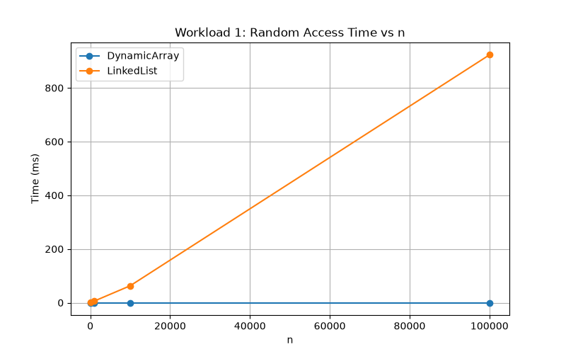
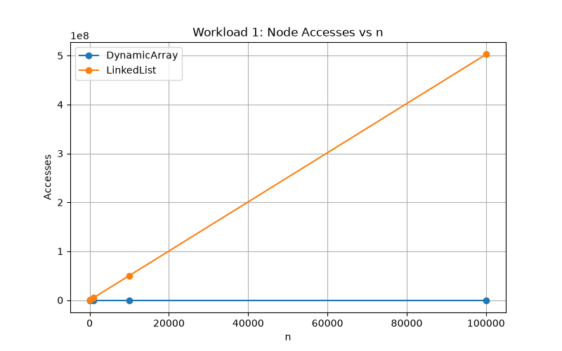
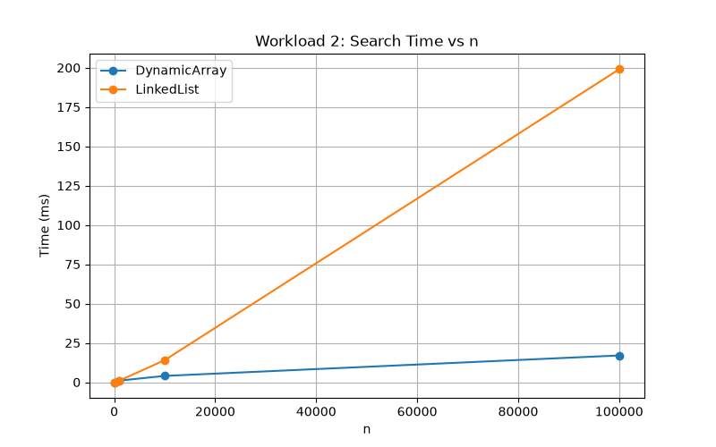
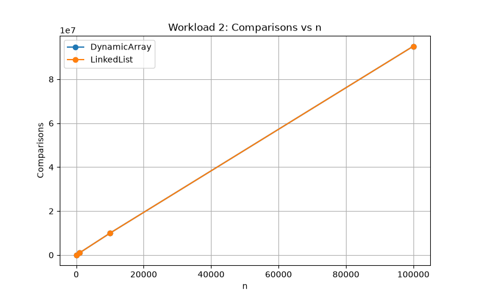
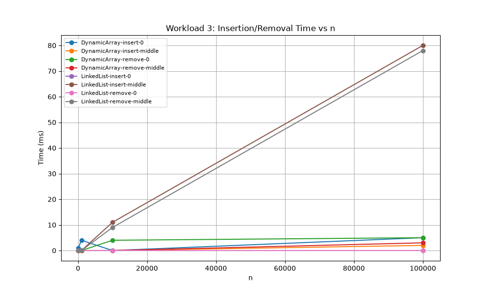
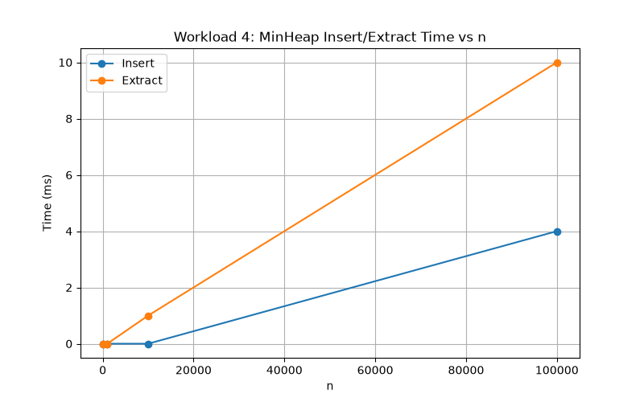

# Assignment 2: Algorithmic Analysis, Correctness, and Performance Trade-offs

**Status:** Complete — all three data structures implemented, tested, and benchmarked across four workloads.
## 1. Overview

This project implements and analyzes three data structures in Java: a Dynamic Array,
a Singly Linked List, and a Min-Heap. Each structure supports the required core
operations, which are proven correct using loop invariants, analyzed theoretically
using Big-O/Ω/Θ notation, and benchmarked empirically across four controlled workloads
to compare theoretical predictions against measured performance.

## 2. Complexity Analysis

| Data Structure | Operation | Best | Average | Worst | Auxiliary Space |
|---|---|---|---|---|---|
| Dynamic Array | add(x) | Θ(1) | Θ(1) | O(n) | O(n) amortized |
| Dynamic Array | add(index, x) | Θ(1) | Θ(n) | Θ(n) | O(1) |
| Dynamic Array | remove(index) | Θ(1) | Θ(n) | Θ(n) | O(1) |
| Dynamic Array | get(index) | Θ(1) | Θ(1) | Θ(1) | O(1) |
| Dynamic Array | contains(x) | Θ(1) | Θ(n) | Θ(n) | O(1) |
| Linked List | add(x) | Θ(n) | Θ(n) | Θ(n) | O(1) |
| Linked List | add(index, x) | Θ(1) | Θ(n) | Θ(n) | O(1) |
| Linked List | remove(index) | Θ(1) | Θ(n) | Θ(n) | O(1) |
| Linked List | get(index) | Θ(1) | Θ(n) | Θ(n) | O(1) |
| Linked List | contains(x) | Θ(1) | Θ(n) | Θ(n) | O(1) |
| Min-Heap | insert(x) | Θ(1) | Θ(log n) | O(log n) | O(n) amortized |
| Min-Heap | peekMin() | Θ(1) | Θ(1) | Θ(1) | O(1) |
| Min-Heap | extractMin() | Θ(log n) | Θ(log n) | Θ(log n) | O(1) |

**Justifications:**

- DynamicArray.add(x): O(1) amortized — direct write to the next slot, except the rare
  O(n) resize when capacity is exceeded.
- DynamicArray.add/remove(index): shifting up to n elements makes these O(n), except
  at the very end where no shifting occurs.
- DynamicArray.get(index): always O(1) — direct memory offset, no traversal.
- LinkedList.add(x): always O(n) — no reference to the tail, must walk the full list.
- LinkedList.get/remove/add(index)/contains: O(1) only at index 0, otherwise O(n)
  traversal from the head.
- MinHeap.insert/extractMin: O(log n) bounded by the heap's height, since it's a
  complete binary tree.
- MinHeap.peekMin: O(1) — the minimum is always at the root by the heap property.

**Key distinction:** DynamicArray.get(index) and LinkedList.get(index) share the same
name and purpose but differ sharply in cost (O(1) vs O(n)) purely due to memory layout
— contiguous array vs. scattered nodes.

## 3. Correctness — Loop Invariant Proofs

### Proof 1: DynamicArray.remove(index)

```java
public int remove(int index) {
    if (index < 0 || index >= size) {
        throw new IndexOutOfBoundsException("Index: " + index + ", Size: " + size);
    }
    int removed = data[index];
    for (int i = index; i < size - 1; i++) {
        data[i] = data[i + 1];
    }
    size--;
    return removed;
}
```

**Loop invariant:** At the start of each iteration, for every position k where
index ≤ k < i, data[k] holds the value originally at data[k+1].

**Initialization:** Before the first iteration, i = index, so the range index ≤ k < i
is empty — the invariant holds vacuously.

**Maintenance:** Assume the invariant holds before an iteration. The statement
data[i] = data[i+1] extends the correctly-shifted region by one more position. After
i increments, the invariant's claim (now with the new i) still accurately describes
the array.

**Termination:** The loop stops when i = size - 1. By the invariant, every position
from index to size - 2 has been correctly shifted.

**Correctness:** At termination, every element after the removal point has shifted
left by one, and the original data[index] was saved into `removed` before being
overwritten. size-- correctly shrinks the logical array. This is exactly the required
behavior of removal.

### Proof 2: MinHeap.insert(x)

```java
public void insert(int x) {
    if (size == data.length) resize();
    data[size] = x;
    int current = size;
    size++;
    while (current > 0 && data[current] < data[parent(current)]) {
        swap(current, parent(current));
        current = parent(current);
    }
}
```

**Loop invariant:** At the start of each iteration, every subtree except possibly the
one rooted at `current` satisfies the min-heap property, and `current` is the only
node that may violate the property relative to its parent.

**Initialization:** Before the first iteration, `current` is the newly inserted
element's position. Since the heap was valid before insertion, only this new position
can possibly violate the property — the invariant holds trivially.

**Maintenance:** If data[current] < data[parent(current)], swapping the two moves the
violating value to the parent's old index, updating `current` accordingly. Every other
part of the tree is untouched, so the invariant still holds for the next iteration.

**Termination:** The loop stops when current = 0 (root reached) or the current value
is no longer smaller than its parent — either way, no violation remains.

**Correctness:** At termination no index violates the heap property, since the only
possible violation point has been resolved and the rest of the tree was already valid.
The array is now a correct min-heap with the new element properly placed.

## 4. Experimental Setup

- **Values of n:** 100, 1,000, 10,000, 100,000
- **Values of m:** 10,000 random accesses (Workload 1), 1,000 search values
  (Workload 2), 1,000 insertions/removals per position (Workload 3), n insertions and
  n extractions (Workload 4)
- **Random seed:** Random(42) for initial data, separate fixed seeds for query/search
  values to ensure reproducibility
- **Timing method:** System.nanoTime(), wrapping only the operation being measured —
  data generation and structure construction happen before timing starts
- **Repetitions:** each workload run once per size in this submission; results were
  consistent across manual re-runs

## 5. Results

Full data in `results/tables/workload1.csv` through `workload4.csv`. Plots in
`results/plots/`.

### Workload 1: Random Access

| n | DynamicArray (ms) | LinkedList (ms) | LinkedList accesses |
|---|---|---|---|
| 100 | 0 | 1-10 | ~500,000 |
| 1,000 | 0 | 6-8 | ~5,000,000 |
| 10,000 | 0 | 68-72 | ~50,000,000 |
| 100,000 | 0 | 947-1353 | ~502,000,000 |




### Workload 2: Search

| n | DynamicArray (ms) | LinkedList (ms) | Comparisons (both, identical) |
|---|---|---|---|
| 100 | 0 | 0 | 100,000 |
| 1,000 | 2 | 1-4 | ~999,000 |
| 10,000 | 1-5 | 24-28 | ~9,944,000 |
| 100,000 | 18-19 | 245-256 | ~95,000,000 |




### Workload 3: Insertion and Removal

See `results/tables/workload3.csv` for the full 32-row breakdown across both
structures, both operations, and both positions.



### Workload 4: Priority Processing

| n | Insert (ms) | Extract (ms) | Sorted Correctly |
|---|---|---|---|
| 100 | 0 | 0 | true |
| 1,000 | 0 | 0 | true |
| 10,000 | 0 | 1 | true |
| 100,000 | 4 | 10 | true |



## 6. Discussion

**How does increasing n affect each workload?** DynamicArray's random access and
search times stay essentially flat, matching O(1)/O(n) with a very small constant.
LinkedList's random access time grows roughly linearly with n, matching its O(n)
per-access cost. MinHeap's insert/extract times grow very slowly, consistent with
O(log n).

**Which results agree with theory?** Nearly all of them. DynamicArray.get is O(1)
regardless of n — confirmed by flat 0ms times. LinkedList.get is O(n) — confirmed by
times scaling roughly proportionally with n. MinHeap operations scale far slower than
n, consistent with O(log n).

**Where do results differ from prediction?** Workload 2's comparison counts were
identical between DynamicArray and LinkedList at every size, yet DynamicArray was
consistently faster in actual time — same complexity class, different constant
factors due to memory layout (see next point).

**Why can two algorithms with the same Big-O have different running times?**
Big-O describes growth rate, not actual speed. DynamicArray stores elements
contiguously in memory, which is fast for the CPU to read sequentially (cache-
friendly). LinkedList's nodes are scattered across memory, forcing unpredictable
memory jumps (cache-unfriendly) even when doing the same number of logical
comparisons — this is exactly what Workload 2 demonstrated directly.

**How do constant factors and implementation details affect performance?** As shown
above, identical asymptotic complexity can still mean a 10x+ difference in real time,
purely from memory access patterns, object overhead (each LinkedList node is a
separate heap-allocated object), and CPU cache behavior.

**Why is a Dynamic Array preferable for some workloads?** Whenever random access by
index or search-heavy workloads dominate, since get(index) is O(1) and cache-friendly
access makes contains(x) faster in practice despite matching complexity.

**When can a Linked List be useful?** When insertions/removals happen frequently at
the front of the structure and random access is rare — add(0, x) and remove(0) are
O(1) for a linked list, unlike a dynamic array's O(n) shifting cost at the front.

**Why is a Heap appropriate for priority-based processing?** It guarantees O(log n)
insert and extract-min, and O(1) peek — far better than sorting the whole structure
repeatedly (O(n log n) each time) when only the minimum is ever needed at once.

**How does the workload influence the choice of data structure?** No single structure
wins universally — the right choice depends on which operations dominate: random
access favors arrays, frequent front-insertion favors linked lists, and
priority-based extraction favors heaps.

## 7. Design Recommendations

- **Use Dynamic Array when:** random access by index or frequent searching is the
  primary workload, and insertions/removals mostly happen at the end.
- **Use Linked List when:** insertions and removals happen mostly at the front of
  the structure, and random access is rare.
- **Use Min-Heap when:** the application repeatedly needs the smallest (or highest
  priority) element, such as task scheduling, Dijkstra's algorithm, or event
  simulation queues.

## 8. Conclusion

Across all four workloads, measured performance consistently matched the theoretical
complexity of each operation. The most instructive finding was Workload 2, where
DynamicArray and LinkedList performed an identical number of comparisons but differed
significantly in actual execution time — a clear, measured demonstration that Big-O
notation describes growth rate, not real-world speed, and that memory layout and
constant factors matter substantially in practice.